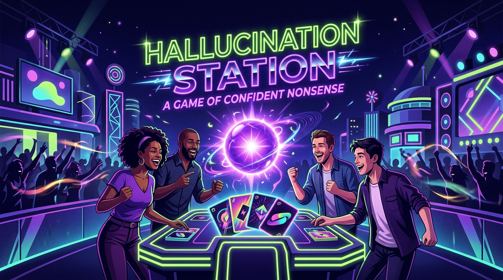
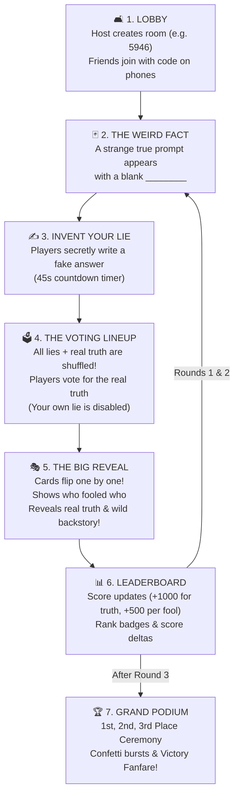

# ✦ Hallucination Station: A Game of Confident Nonsense
### *Handshake AI Skills Studio × OpenAI Multiplayer Game Challenge*

<div align="center">



**The real-time party bluffing game where real life is stranger than fiction.**  
*Invent convincing fake answers to fool your friends, and spot the unbelievable truth!*

[](https://github.com/sriram-2601/Game)
[](https://github.com/sriram-2601/Game)
[](https://app.netlify.com/drop)
[](https://github.com/sriram-2601/Game)

</div>

---

## 📖 Table of Contents
1. [What is Hallucination Station? (In Plain English)](#-what-is-hallucination-station-in-plain-english)
2. [Visual Game Map & Flow](#-visual-game-map--flow)
3. [How to Play in 4 Easy Steps](#-how-to-play-in-4-easy-steps)
4. [Scoring & Winning](#-scoring--winning)
5. [Smart Features & Easter Eggs](#-smart-features--easter-eggs)
6. [Host vs. Player Experience](#-host-vs-player-experience)
7. [How to Launch & Play (Zero IT Knowledge Needed!)](#-how-to-launch--play-zero-it-knowledge-needed)
8. [For Developers: Under the Hood](#-for-developers-under-the-hood)
9. [Project File Map](#-project-file-map)

---

## 🌟 What is Hallucination Station? (In Plain English)

Have you ever heard a fact so bizarre that you thought: *"There is no way that actually happened"*? 

**Hallucination Station** turns that exact feeling into a laugh-out-loud multiplayer party game!

> [!NOTE]
> **The Big Idea**: Every round, the game displays a real, verified, mind-boggling fact from history, science, or nature—but with a key word or phrase missing.
> 
> * **Your Goal**: Invent a clever, convincing fake answer (a "hallucination") to trick your friends into voting for it.
> * **The Catch**: You also have to guess which answer in the lineup is the single real truth!
> * **The Laughs**: You score massive points every time your friends fall for your fake answer!

No apps to download. No accounts to create. No passwords to remember. Everyone just opens the game in their phone or laptop browser, types a 4-digit room code, and starts playing together in seconds.

---

## 🗺️ Visual Game Map & Flow

Here is how a complete game flows from start to podium:



---

## 🕹️ How to Play in 4 Easy Steps

```
┌────────────────────────────────────────────────────────────────────────┐
│  STEP 1: READ THE BIZARRE FACT                                         │
│  "In 1923, jockey Frank Hayes won a steeplechase at Belmont Park       │
│   despite suffering a fatal ________ mid-race."                        │
└──────────────────────────────────┬─────────────────────────────────────┘
                                   │
                                   ▼
┌────────────────────────────────────────────────────────────────────────┐
│  STEP 2: WRITE A BELIEVABLE FAKE (On your phone)                       │
│  Player 1 writes: "Lightning strike"                                   │
│  Player 2 writes: "Seizure"                                            │
│  (The Real Truth is secretly: "Heart attack")                          │
└──────────────────────────────────┬─────────────────────────────────────┘
                                   │
                                   ▼
┌────────────────────────────────────────────────────────────────────────┐
│  STEP 3: VOTE ON THE SHUFFLED CARDS                                    │
│  [ Lightning strike ]   [ Heart attack ]   [ Seizure ]   [ Heatstroke ]│
│  Everyone tries to pick out the REAL truth!                            │
└──────────────────────────────────┬─────────────────────────────────────┘
                                   │
                                   ▼
┌────────────────────────────────────────────────────────────────────────┐
│  STEP 4: WATCH THE REVEAL & EARN POINTS!                               │
│  • Friend voted for your lie? You get Fooling Points!                  │
│  • You spotted the actual truth? You get Truth Points!                 │
└────────────────────────────────────────────────────────────────────────┘
```

---

## 🏆 Scoring & Winning

The stakes escalate with every round, making dramatic comebacks possible right until the final seconds:

| Round | Stage Name | Points for Finding the Truth | Points for Each Friend You Fooled |
|:---:|:---|:---:|:---:|
| **Round 1** | **Warmup Deceptions** | **+1,000 pts** | **+500 pts** per fool |
| **Round 2** | **High Stakes Bluffing** | **+2,000 pts** | **+1,000 pts** per fool |
| **Round 3** | **The Grand Finale** | **+3,000 pts** | **+1,500 pts** per fool |

> [!TIP]
> **Winning Strategy**: Don't write something obviously ridiculous like *"an alien abduction"*. Write something believable that sounds just like historical trivia (e.g., *"broken stirrup"* or *"bee sting"*). The more friends vote for you, the faster you climb the leaderboard!

---

## 🧠 Smart Features & Easter Eggs

### 1. 🛡️ The "Truth Trap" (Smart Duplicate Prevention)
What happens if a player accidentally guesses the actual real answer during the submission phase?
* **Normal trivia games break down** when this happens.
* **In Hallucination Station**: The game secretly intercepts the answer and shows a private warning:  
  *🔥 "Wait, that's actually the real truth! Don't spoil the fun—write a convincing lie to fool your friends!"*

### 2. 🤖 AI Decoys (For 2-Player Lobbies)
When playing with just 2 people, party games often feel empty. Hallucination Station automatically injects clever decoy answers from its verified question bank so every voting round **always has at least 4 competitive choices**.

### 3. 🔒 Anti-Cheat State Shield
Curious tech-savvy friends can't cheat by opening browser Developer Tools. During the voting phase, the server completely strips all answer author IDs and the `isReal` flag from the network payload. The truth is only revealed when the voting round ends!

### 4. 🔊 Zero-Asset Synthesized Retro Audio
No audio files need to download or buffer. The game uses the browser's built-in **Web Audio API** to generate nostalgic game-show sound effects:
* **Ticking Clock**: Urgency clicks during the final 8 seconds of countdowns.
* **Whoosh & Thud**: Satisfying feedback when locking in lies and votes.
* **Truth Reveal**: Shimmering synth chord when the real truth is unveiled.
* **Victory Fanfare**: Celebratory arpeggio when the champion takes the podium.
* *(Includes an instant Mute/Unmute button in the top bar!)*

### 5. 🎉 Interactive Confetti Particle Engine
A pure canvas-driven particle explosion showers the winners on the podium screen with customizable gravity and physics!

---

## 👥 Host vs. Player Experience

Whether you're playing on a shared living room TV, a classroom projector, or just huddled over phones:

| Feature | The Host | Joining Players |
|---|:---:|:---:|
| **Creating / Joining** | Clicks "Start a new game" & shares code | Clicks "Join a friend" & types code |
| **Controls** | Can start the game & advance rounds | Follows game flow automatically |
| **Input Device** | Laptop, iPad, or Phone | Any smartphone or tablet |
| **Submitting & Voting** | Plays and submits lies like everyone else | Submits lies & votes on their device |
| **Rematch** | Hits "Play Again" to restart with same group | Stays in the room for next game |

---

## 🚀 How to Launch & Play (Zero IT Knowledge Needed!)

### Option A: Play Right Now on the Web (30 Seconds)
1. Go to the free deployment link or Netlify Drop: **[https://app.netlify.com/drop](https://app.netlify.com/drop)**.
2. Drag and drop **`netlify-ready-game.zip`** (found on your Desktop).
3. Netlify will instantly generate a live website link (e.g., `https://hallucination-station.netlify.app`).
4. Share that link with your friends or family and start playing!

---

### Option B: Run Locally on Your Computer
If you have Node.js installed and want to run it on your own machine:

```bash
# 1. Install dependencies (only needed once)
npm install

# 2. Start the game server
npm run dev
```

* Open **`http://localhost:5173/`** in your browser.
* Open an **Incognito window** or connect your phone via your local Wi-Fi to test two players together!

---

## 💻 For Developers: Under the Hood

For technical reviewers and judges of the **Handshake × OpenAI Challenge**:

```
 ┌──────────────────────┐         HTTP GET/POST         ┌───────────────────────────────┐
 │   Browser Clients    │ ◄───────────────────────────► │ Netlify Function: game.ts     │
 │ (Vanilla TS + CSS)   │   /.netlify/functions/game    │ (Strong Consistency + ETag)   │
 └──────────────────────┘                               └──────────────┬────────────────┘
                                                                       │
                                                                       ▼
                                                        ┌───────────────────────────────┐
                                                        │ Netlify Blobs                 │
                                                        │ (Conditional Writes: onlyIf)  │
                                                        └───────────────────────────────┘
```

* **Frontend**: Pure HTML5, Vanilla CSS design tokens, and TypeScript built with Vite. No bloated framework runtime.
* **Serverless Backend**: Standard Netlify Function at `netlify/functions/game.ts` using `@netlify/blobs` for strong consistency.
* **Atomic State Mutation**: Uses conditional writes (`onlyIf: { etag }`) with automatic exponential backoff jitter to handle concurrent votes without race conditions.
* **Local Emulation**: Includes a built-in Vite dev middleware that mirrors Netlify Functions and Blobs locally with zero external accounts or API keys required.

---

## 📁 Project File Map

```
antigravitygame/
├── cover.jpg                     # High-resolution 16:9 challenge cover art
├── netlify.toml                  # Netlify deployment configuration
├── netlify-ready-game.zip        # Pre-packaged 1-click Netlify Drop archive
├── package.json                  # Dependencies & build scripts
├── tsconfig.json                 # TypeScript compiler configuration
├── vite.config.ts                # Vite config + local Netlify Function dev server
│
├── lib/                          # Core game logic (outside netlify/functions)
│   ├── gameCore.ts               # State transitions, scoring formulas & sanitization
│   ├── questions.ts              # Verified question bank with 20+ bizarre facts
│   ├── storage.ts                # Netlify Blobs strong consistency storage adapter
│   └── types.ts                  # Shared TypeScript interfaces & types
│
├── netlify/
│   └── functions/
│       └── game.ts               # Standard Netlify serverless API handler
│
├── public/                       # Static public assets (cover, favicon, icons)
│
└── src/                          # Frontend client code
    ├── audio.ts                  # Synthesized Web Audio API sound generator
    ├── confetti.ts               # Custom celebratory canvas confetti engine
    ├── main.ts                   # Client state management, polling & UI screens
    └── style.css                 # Dark-mode game-show visual design system
```

---

<div align="center">

**Built with ❤️ for the Handshake AI Skills Studio × OpenAI Multiplayer Game Challenge.**  
*May the best bluffer win!*

</div>
